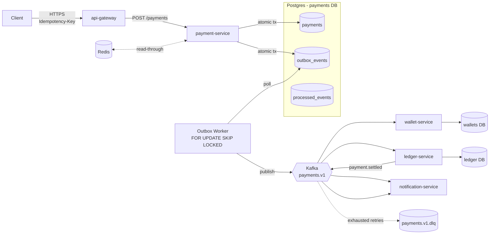

# event-driven-payment-system

[](https://github.com/talhariaz324/event-driven-payment-system/actions/workflows/ci.yml)
[](LICENSE)
[](.nvmrc)
[](tsconfig.base.json)

Reference architecture for an event-driven payment system built with **NestJS**, **Apache Kafka**, **PostgreSQL**, and the **Transactional Outbox Pattern**.

This repo is a teaching architecture — every design choice (and its tradeoff) is documented inline. It demonstrates the patterns you reach for when a synchronous monolith stops scaling: bounded contexts, asynchronous fan-out, exactly-once-effective processing, and survivable failure modes. The write-path (`payment-service` → outbox → Kafka) and one consumer (`wallet-service`, debiting balances with composite-key idempotency and optimistic locking) are implemented end-to-end. `ledger-service` and `notification-service` are scaffolded skeletons whose role is documented but not built.

---

## Architecture at a glance



| Service | Role | Tech |
|---|---|---|
| `api-gateway` | Public HTTP edge, auth, rate limiting | NestJS, Axios |
| `payment-service` | Source of truth for payments + outbox | NestJS, Prisma, Postgres, Kafka |
| `wallet-service` | User wallet balances | NestJS, Postgres, Kafka |
| `ledger-service` | Double-entry ledger | NestJS, Postgres, Kafka |
| `notification-service` | Email / SMS / push | NestJS, Kafka |
| `@eds/kafka-core` | Shared producer + consumer with retries, DLQ, backoff | kafkajs, pino |
| `@eds/shared-types` | Topic constants, event envelopes, payload types | TypeScript |

---

## 1. Why event-driven architecture

Synchronous request/response chains break down in three ways at scale:

1. **Coupling of availability** — if `wallet-service` is down, the payment write fails. The user sees a 500 for a problem they had no part in.
2. **Tail-latency multiplication** — N synchronous downstream calls means p99 = the worst of N tails. Each added service makes the system slower in a multiplicative way.
3. **Fan-out is costly** — adding a "now also notify analytics" requirement means modifying the write-path code path, deploying it, and assuming a new failure mode.

Event-driven architecture decouples *what happened* from *who cares about it*:

- Write path commits its own state and publishes a fact (`payment.initiated`).
- Each downstream consumer subscribes independently. Adding a new consumer is a deploy, not a code change to the write path.
- Failures in one consumer don't degrade unrelated consumers or the write path.

The cost: **eventual consistency**. The payment row exists *now*, but the wallet may not be debited for ~100ms. For nearly all consumer-facing flows this is fine; for the rare cases that need read-your-writes consistency, the payment-service can return the post-commit state synchronously without waiting for downstream propagation.

---

## 2. Why Kafka over RabbitMQ / SQS

| Need | RabbitMQ | SQS | Kafka |
|---|---|---|---|
| Durable log of events (replay capability) | No (queue, message gone after ack) | No (DLQ only) | **Yes (immutable log, retention)** |
| Per-key ordering guarantees | No | FIFO queue: yes but limited throughput | **Yes (per partition)** |
| Throughput per cluster | Tens of k msg/s | Hundreds of k msg/s | **Millions of msg/s** |
| Multiple independent consumers reading the same data | Hard (fanout exchange + queue per consumer) | Hard | **Native (consumer groups)** |
| Replay events (e.g. backfill new service) | No | No | **Yes (offset reset)** |
| Operational complexity | Low | None (managed) | High (or use MSK / Confluent Cloud) |

Kafka wins for this workload because of three properties:

1. **Replayability** — when you add a new service (e.g. fraud detection), it can rebuild its state by consuming `payments.v1` from offset 0. With a queue you'd need to migrate via dual-writes.
2. **Per-partition ordering** — partition key = `paymentId` means all events for one payment are processed in order by one consumer, even with 50 consumer pods running in parallel.
3. **Consumer groups** — wallet, ledger, and notification each maintain independent offsets on the same topic. No fan-out exchange juggling.

Kafka loses on operational simplicity. If you don't need replay or strict ordering and your throughput is < 10k msg/s, SQS is a better tool.

---

## 3. Why the transactional outbox

The dual-write problem is the bug:

```ts
await db.insert('payments', payment);
await kafka.produce('payments.v1', event);  // ← can fail after the DB commit
```

If the second call fails, the payment exists but no downstream service knows. Retrying is unsafe (might double-publish on partial-success). 2PC across Postgres and Kafka is operationally toxic.

Outbox replaces it with a single write to one transactional resource:

```sql
BEGIN;
  INSERT INTO payments ...;
  INSERT INTO outbox_events ...;  -- same transaction
COMMIT;
```

A separate poller publishes the outbox row to Kafka *after* the commit, with retries. Worst case: a few-hundred-millisecond delay between the DB commit and the Kafka publish. Best case: the user is unaffected by Kafka being down — payments still write successfully, events drain when Kafka recovers.

Full deep-dive: [`docs/outbox-pattern.md`](docs/outbox-pattern.md).

---

## 4. How idempotency works (3 layers)

| Layer | Mechanism | Where |
|---|---|---|
| **HTTP** | `Idempotency-Key` header → unique constraint on `payments.idempotency_key` | `payment-service` |
| **Producer** | Each event has a UUIDv4 `eventId`; producer is `idempotent: true` (kafkajs) so retries within one session don't duplicate at the broker | `@eds/kafka-core` |
| **Consumer** | `INSERT INTO processed_events (event_id, consumer) ON CONFLICT DO NOTHING`. If no row inserted → already processed → skip the side-effect | each consumer service |

Layered defense-in-depth. Any single layer being absent or buggy is caught by the next.

---

## 5. Retries and DLQ

Implemented in `@eds/kafka-core/src/kafka-consumer.ts`:

- Each handler wrapped in a retry loop with exponential backoff: `200ms × 2^attempt`, capped at 30s
- Max 5 attempts per message
- After exhaustion: original message + headers (`dlq-reason`, `dlq-original-topic`, `dlq-original-offset`, `event-id`) is published to `payments.v1.dlq`
- The consumer commits the offset on the original topic so the bad message doesn't block the partition

**DLQ ops loop:**

1. Alert when DLQ depth > 0
2. Operator inspects the message + headers
3. Fixes the underlying bug (e.g. schema change, downstream API regression)
4. Re-publishes the original event to the source topic — does NOT reset consumer-group offsets (that would replay good events too)

---

## 6. Redis caching strategy (designed, not yet implemented)

Section 6 documents the cache layer the architecture is designed for, not
code that currently ships. The repo does not import `ioredis` from any
business path; the `redis` container in docker-compose is leftover scaffolding
from an earlier iteration and is scheduled for removal in a follow-up.
Listing this honestly so reviewers can match claim to code.

When this lands, two patterns:

- **Read-through** for `GET /payments/:id` (which is also pending): cache key `payment:{id}`, TTL 60s, populated lazily on first read after cache miss.
- **Cache-aside with event invalidation** for hot reads of derived state (e.g. user balance): invalidate on `payment.settled` event from the consumer side.

Stampede protection: Redis `SETNX` with a short lock, falling back to a soft-stale value while one process refreshes. N concurrent cache misses must not all stampede the database.

What we explicitly do NOT plan to cache:

- Write-side data (payments table) — caching the source of truth introduces consistency bugs you can't reason about.
- Anything time-sensitive enough that a 60s stale read causes a financial bug — e.g. credit-limit checks.

---

## 7. Postgres schema design (`payment-service`)

```
payments (
  id              uuid pk,
  user_id         uuid,
  amount          numeric(18,4),
  currency        char(3),
  status          payment_status enum,
  idempotency_key text unique,           -- defends HTTP retries
  created_at      timestamptz,
  updated_at      timestamptz,
  index (user_id),
  index (status)
)

outbox_events (
  id              uuid pk,
  aggregate_type  text,
  aggregate_id    text,                  -- becomes Kafka partition key
  event_type      text,
  topic           text,
  payload         jsonb,                 -- full EventEnvelope
  status          outbox_status enum,    -- PENDING | PUBLISHED | FAILED
  attempts        int,
  created_at      timestamptz,
  published_at    timestamptz,
  last_error      text,
  index (status, created_at)             -- partial index where status='PENDING' for cheap polling
)

processed_events (
  event_id        text,
  consumer        text,
  primary key (event_id, consumer),
  processed_at    timestamptz
)
```

Decisions worth defending:

- **`numeric(18,4)` not `float`** for money — floats lose precision and you cannot get away with that for currency. Decimal or smallest-currency-unit-as-bigint are the only acceptable choices.
- **`idempotency_key` uniqueness at the DB level**, not application level — race-free, no double-spend on retried HTTP calls.
- **Partial index on `outbox_events`** so the polling query scans 100s of rows, not millions.

---

## 8. Horizontal scaling challenges

Detailed in [`docs/scaling.md`](docs/scaling.md). Highlights:

- **Outbox pollers scale safely** with `FOR UPDATE SKIP LOCKED` — multiple pods take disjoint slices
- **Consumer parallelism is bounded by partition count** — pick generously upfront (32–64 for production)
- **Hot-key skew** is the silent killer; partition by compound key or rate-limit at the producer
- **`outbox_events` table growth** must be cleaned up — partition by month, drop after 7 days

---

## 9. Ordering guarantees

- **Per-aggregate ordering**: partition key = `paymentId`. All events for payment `X` always land on the same partition. A single consumer pod processes them in order. ✅
- **Cross-aggregate ordering**: not preserved. Payment `X` and payment `Y` can be processed in any order across consumers. This is fine for nearly all business logic.
- **Across topics**: explicitly not guaranteed. If you need "wallet must be debited before notification is sent," chain the topics: `payment.initiated` → `wallet-service` → `wallet.debited` → `notification-service`. Don't rely on cross-topic timing.

---

## 10. Failure scenarios

| What dies | Effect | Recovery |
|---|---|---|
| Kafka cluster | Outbox rows accumulate as PENDING. Write path unaffected. | Kafka recovers → poller drains backlog |
| One Kafka broker | Some partitions unavailable until controller reassigns. ~10s. | Automatic |
| Postgres primary | Write path 5xx until failover. | Pg failover → restart pods |
| One outbox poller pod | Other pods continue (SKIP LOCKED). | k8s reschedules |
| One consumer pod | Other pods in the consumer group take over its partitions on rebalance. | Automatic |
| Bad event (poison message) | Retry budget exhausts → DLQ. Partition keeps moving. | Operator fixes + re-publishes |
| Consumer bug introduced | Backlog grows. Lag alert fires. | Roll back deploy |

The system is designed to **degrade in slices, not collapse** — most failures only stall the affected service, not the write path.

---

## 11. Security concerns

- **Kafka:** SASL/SCRAM + TLS in production (config plumbed through `@eds/kafka-core`). Plaintext only in local dev.
- **Postgres:** TLS-required connections, IAM auth on managed services (RDS / Cloud SQL).
- **Service-to-service:** API gateway is the only public surface. Internal services run on a private subnet, no public endpoints.
- **PII in events:** events include `userId` (UUID, not email). Avoid putting raw email/phone in Kafka — it ends up in DLQ logs, replicas, and backups for years. Lookup downstream by `userId`.
- **Idempotency keys are not secrets** but should be high-entropy (UUIDv4) — predictable keys allow replay attacks if your auth layer is weak.
- **Outbox payload is JSONB:** no SQL injection surface (it's not interpreted). Don't `eval()` consumer payloads on the consume side either.

---

## 12. Tradeoffs

**Pros:**

- ✅ Survivable: any one component can fail without taking down the system
- ✅ Replayable: new services can be added by consuming from offset 0
- ✅ Auditable: Kafka log is an immutable history of every event
- ✅ Horizontally scalable on every axis: API tier, write tier, poller, consumers
- ✅ Strong per-aggregate ordering despite parallelism

**Cons:**

- ❌ Eventual consistency — if you query the wallet 50ms after a payment, it may not yet reflect the debit
- ❌ Operational surface — Kafka is not free to run. Use a managed offering (MSK, Confluent Cloud) until you have a reason not to.
- ❌ Debugging distributed systems is harder than debugging a monolith. Tracing (OpenTelemetry) is non-optional.
- ❌ Schema evolution requires discipline. The `schemaVersion` field exists in every event for a reason.
- ❌ More moving parts — more things to monitor, more failure modes to think about.

---

## 13. When NOT to use this architecture

- **You have one consumer of the events, and it's the same service that wrote them.** Use a normal Postgres transaction.
- **You have < ~1k tx/sec and don't need replay.** A monolith with a transactional in-process job queue (e.g. pgmq, BullMQ on Redis) is simpler and operationally cheaper.
- **You need strict global ordering across all aggregates.** Kafka can give you that only by setting partitions=1, which kills your throughput. Pick a different design (single-writer ledger, distributed log with global sequence).
- **You can't tolerate eventual consistency anywhere in the user-facing flow.** Some banking and healthcare flows fall here. Use synchronous orchestration (saga + compensations) instead.
- **You're a team of < 3.** The operational burden of running Kafka + Postgres + Redis + 5 services is significant. Defer this architecture until you genuinely need it.

---

## 14. Local setup

**Requirements:** Docker Desktop (with Compose v2), Node 20+, npm 10+.

```bash
# 1. install workspace deps
npm install

# 2. build shared packages first (services depend on their dist)
npm run build --workspace=@eds/shared-types
npm run build --workspace=@eds/kafka-core

# 3. seed env files (one per service)
for s in api-gateway payment-service wallet-service ledger-service notification-service; do
  cp services/$s/.env.example services/$s/.env
done

# 4. bring up infra + services
npm run infra:up

# 5. tail logs
npm run infra:logs

# 6. smoke test
curl -X POST http://localhost:3000/payments \
  -H 'Content-Type: application/json' \
  -H 'Idempotency-Key: 00000000-0000-0000-0000-000000000001' \
  -d '{"userId": "11111111-1111-1111-1111-111111111111", "amount": 100.00, "currency": "USD"}'

# expect: 202 { "paymentId": "...", "status": "INITIATED", "deduplicated": false }
# repeat the same command → "deduplicated": true (idempotency working)
```

Health endpoints:

```bash
curl http://localhost:3000/health/liveness
curl http://localhost:3001/health/readiness   # checks Postgres
```

---

## 15. Future improvements

- [ ] **Observability:** OpenTelemetry traces propagated via Kafka headers, Prometheus metrics scraped from each service, Grafana dashboards
- [ ] **Schema registry:** move from inline JSON envelopes to Avro or Protobuf with Confluent Schema Registry — buys schema evolution checks at produce time
- [ ] **Saga orchestration** for multi-step flows that need compensation (e.g. refund: reverse-debit wallet + credit ledger + notify)
- [ ] **Circuit breakers** on the API gateway → downstream calls (e.g. opossum)
- [ ] **Migrate Prisma → Drizzle or raw SQL** for the outbox path — Prisma's overhead dominates the polling tick
- [ ] **CDC alternative** to outbox polling using Debezium → Kafka, for sub-100ms event publish latency
- [ ] **Multi-region**: MirrorMaker 2 between Kafka clusters, regional Postgres with logical replication
- [ ] **Replay tooling**: CLI to backfill a new consumer service by re-reading from a topic offset/timestamp
- [ ] **Chaos testing**: Toxiproxy in CI to inject latency / partitions and verify the outbox + retry path
- [ ] **Load test**: k6 scenario hitting POST /payments at sustained 5k rps to validate the scaling claims

---

## Repo layout

```
event-driven-payment-system/
├── services/
│   ├── api-gateway/             # public HTTP edge
│   ├── payment-service/         # source of truth + outbox worker
│   ├── wallet-service/
│   ├── ledger-service/
│   └── notification-service/
├── packages/
│   ├── kafka-core/              # producer, consumer, retries, DLQ
│   └── shared-types/            # topic constants, event envelopes
├── infra/
│   ├── docker-compose.yml       # full local stack
│   └── postgres-init.sql
├── docs/
│   ├── architecture.md
│   ├── outbox-pattern.md
│   └── scaling.md
└── README.md
```

## License

MIT
