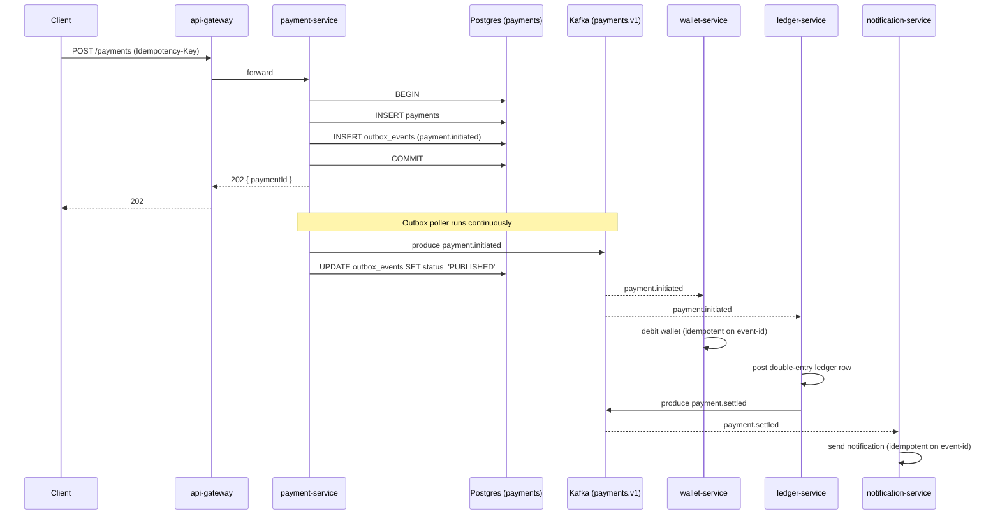

# Architecture

## Bounded contexts

| Service | Owns | Talks to |
|---|---|---|
| `api-gateway` | Public HTTP surface, auth, rate limiting | `payment-service` (sync), aggregates downstream reads |
| `payment-service` | `payments`, `outbox_events`, `processed_events` tables. Source of truth for payment state | Postgres, Kafka (produces `payments.v1`) |
| `wallet-service` | User wallet balances, holds | Postgres (own DB), Kafka (consumes `payments.v1`) |
| `ledger-service` | Double-entry ledger entries | Postgres (own DB), Kafka (consumes `payments.v1`) |
| `notification-service` | User-facing emails / push | Kafka (consumes `payments.v1`), email/SMS providers |

**Database-per-service.** No service reads another service's tables. Cross-context state is communicated via Kafka events only. This is enforced by separate databases (`payments`, `wallets`, `ledger`) on the shared Postgres cluster, each owned exclusively by one service.

## Data flow — happy path

## Why this shape

- **Async fan-out via Kafka** instead of synchronous REST calls between services: `payment-service` does not block on wallet, ledger, or notification. It commits its own state and gets out of the way. Downstream services consume independently and can fail/recover without affecting the write path.
- **Outbox pattern** to atomically persist state + outbound event in the same Postgres transaction. Without this, you have the dual-write problem: DB commits succeed but Kafka publish fails, or vice versa, leaving the system inconsistent.
- **Idempotency at three layers:**
  1. HTTP `Idempotency-Key` header → unique constraint on `payments.idempotency_key`
  2. Kafka events carry a globally unique `eventId` (UUIDv4)
  3. Each consumer records `(event_id, consumer_name)` in `processed_events` before doing side-effects
- **Database-per-service** prevents shared-table coupling that would break the microservice contract.

## Topics

| Topic | Producer | Consumers | Partition key |
|---|---|---|---|
| `payments.v1` | `payment-service` | wallet, ledger, notification | `paymentId` |
| `wallets.v1` | `wallet-service` | ledger, notification | `walletId` |
| `ledger.v1` | `ledger-service` | analytics (future) | `entryId` |
| `payments.v1.dlq` | any consumer (on poison/exhausted retries) | manual triage | original key |

Partition key is the aggregate ID so all events for one payment land on the same partition → strict per-aggregate ordering.
